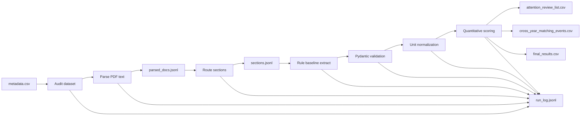

# Workflow Graph

```mermaid
flowchart LR
  A["metadata.csv"] --> B["Audit dataset"]
  B --> C["Parse PDF text"]
  C --> D["parsed_docs.jsonl"]
  D --> E["Route sections"]
  E --> F["sections.jsonl"]
  F --> G["Rule baseline extract"]
  G --> H["Pydantic validation"]
  H --> I["Unit normalization"]
  I --> J["Quantitative scoring"]
  J --> K["attention_review_list.csv"]
  J --> L["cross_year_matching_events.csv"]
  J --> M["final_results.csv"]
  B --> N["run_log.jsonl"]
  C --> N
  E --> N
  G --> N
  H --> N
  I --> N
  J --> N
```

Parser note: `parse_docs.py` uses MinerU markdown when available and falls back to local `pypdf` text extraction when MinerU markdown is absent.
