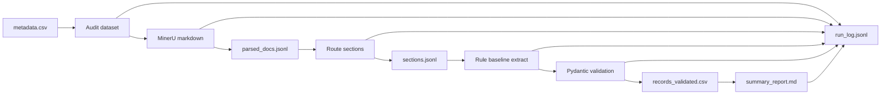

# Workflow Graph

```mermaid
flowchart LR
  A["metadata.csv"] --> B["Audit dataset"]
  B --> C["MinerU markdown"]
  C --> D["parsed_docs.jsonl"]
  D --> E["Route sections"]
  E --> F["sections.jsonl"]
  F --> G["Rule baseline extract"]
  G --> H["Pydantic validation"]
  H --> I["records_validated.csv"]
  I --> J["summary_report.md"]
  B --> K["run_log.jsonl"]
  C --> K
  E --> K
  G --> K
  H --> K
  J --> K
```
